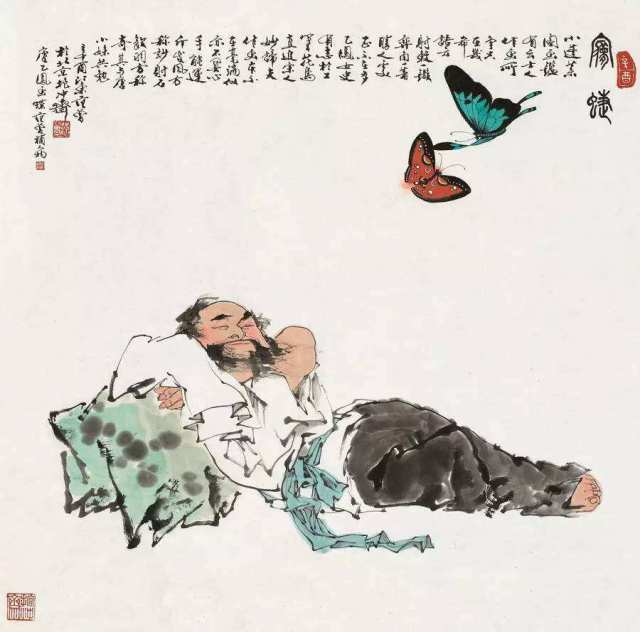

# 大相径庭

**大 相 径 庭**

- 径：门外路径。
- 庭：庭院。

原指从门外小路到门内庭院还有一段距离。后用来比喻相差很远，大不相同。多用来形容
事物区别明显，意见、看法截然不同。也形容彼此矛盾，相去很远。亦作“大有径庭”或
“大相迳庭”。和“天壤之别”都有“相差很远”的意思。但“大相径庭”常含有“彼此矛盾”的意思，
“天壤之别”仅强调差别极大。

近义词：泾渭分明、迥然不同、天壤之别、截然不同

反义词：并行不悖、不相上下、相差无几、大同小异

## 出处

《庄子·逍遥游》：“吾惊怖其言；犹河汉而无极也；大有径庭；不近人情焉。”

## 译文：

《庄子·逍遥游》：“我十分惊恐他的言谈，就好像天上的银河没有边际，跟一般人的言谈
差异甚远，确实是太不近情理了。”

## 故事

春秋时期，楚国有一位著名的隐士叫接舆（yú），平时依靠自己耕种来养活自己，剪去头发，
装疯而不肯做官。他喜欢发表各种大而无当的言论，所以当时被人称为楚狂。

据《论语·微子》记载，接舆曾迎孔子之车而歌以劝说孔子不要热衷政治曰：“凤兮凤兮，
何德之衰？往者不可谏，来者犹可追！已而！已而！今之从政者殆而！

（译文：凤鸟啊凤鸟啊！你的德行为什么衰退了呢？过去的事情已经不能换回了，未来的
事情还来得及呀。算了吧，算了吧！如今那些从政的人都危险啊？）”，孔子下车，想和他
交谈。接舆赶快走开了，孔子无法和他交谈。这就是“接舆歌凤”典故的由来。

有一天，肩吾和连叔（都是古代神话中的人物）在一块闲谈，肩吾对连叔说：“最近，我听
了楚狂接舆的一番言论，觉得他的话夸大而无根据，而且越说越离奇，我十分惊恐他的言谈，
就好像天上的银河没有边际，跟一般人的言谈差异甚远，确实是太不近情理了。”

连叔问：“他都说了些什么呀？”

肩吾说：“他说‘在遥远的姑射山上住着一位神人，皮肤润白像冰雪，体态柔美如处女，
不需要吃五谷，能够吸清风喝露水。乘云气驾飞龙，遨游于四海之外。他的神情那么专注，
使得世间万物不受病害，保障老百姓每年都有好收成。’我认为，认为这全是虚妄之言，
一点也不可信。”

连叔听后说：“是呀！对于瞎子没法同他们欣赏花纹和色彩，对于聋子没法同他们聆听钟鼓
的乐声。难道只是形骸上有聋与瞎吗？思想上也有聋和瞎啊！”

**后人将这里的“大有径庭”演化成“大相径庭”这句成语。本意为偏激。因为“径庭”有两者
相距甚远的意思，所以现在人们常用这句成语形容彼此矛盾，相距很远。**
